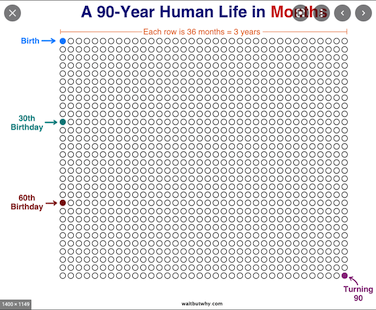
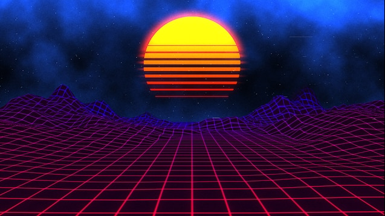

# Day 03
## Clock

On this day we focused on representing time in diffrent shapes and sizes.

### Idea 1: Sketch

In my first idea I wanted to create a grid of life representing your time alive in grids, similar to...

And I wanted to calculate to age of the viewer with ML and webcam access but quicklt discared this part to focus on the actual representation.

I also wanted to have some kind of progress visible preferably in seconds, but in a 100 year live this would take ~500 Mio points to represent, making it computional intensive for P5.js. So I settled on just changing the pixels in the window for a 24h span.

### Idea 1: Code


<iframe src="../content/day03/gridoflife/index.html" width="100%" height="450" frameborder="no"></iframe>


<a href="../content/day03/gridoflife/index.html" target="_blank">Fullscreen</a>

### Idea 2:  Code

For the second idea I had to try out a few things until I settled on a input from a colleague ("Hey this reminds me of some neon sunset"). I got further inspiration and color from google search (neon sunset) . 
P5js allowed for quick POC but with the amount of cubes in this sketch it greatly suffers performance.


<iframe src="../content/day03/neonsunset/index.html" width="100%" height="450" frameborder="no"></iframe>


<a href="../content/day03/neonsunset/index.html" target="_blank">Fullscreen</a>