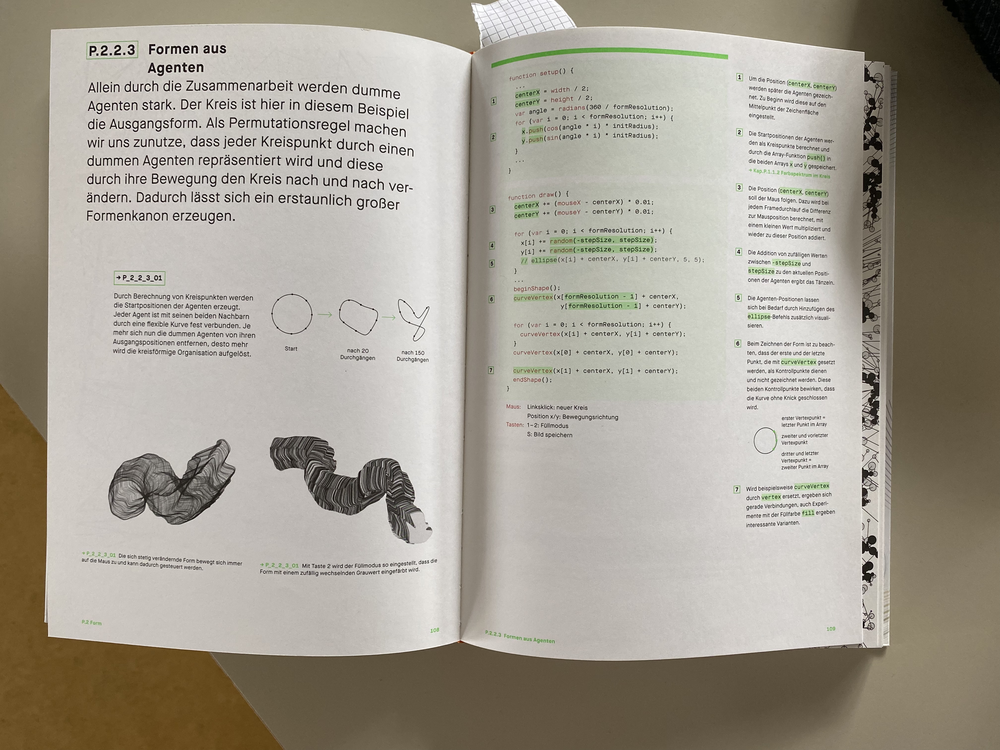

# Day 04
## Drawing Machines

### Idea 1
For Drawing Machines I had a few Ideas but the one most instresting on a technical level was acceloremter data from a mobile device in a browser.
There is an experimental API <a href="https://developer.mozilla.org/en-US/docs/Web/API/Accelerometer">MDN</a>, <a href="https://medium.com/flawless-app-stories/how-to-request-device-motion-and-orientation-permission-in-ios-13-74fc9d6cd140">Medium Post</a> but it requires that the website uses HTTPS and the user initiates the request for permission via a button or similar. 

For HTTPS I used <a href="https://ngrok.com">ngrok</a> to create a secure connection to my localhost.

Although this <a href='../content/day04/accelerometer/index.html'>website</a> is viewable on all devices for the Accelerometer to work one must use a mobile device and press the button in the upper left corner.

<iframe src="../content/day04/accelerometer/index.html" width="200" height="200" frameborder="no"></iframe>


<a href="../content/day04/accelerometer/index.html" target="_blank">Fullscreen</a>

<video width="443" height="960" controls>
  <source src="../content/day04/images/accDot.mp4" type="video/mp4">
Your browser does not support the video tag.
</video>

### Idea 2
For my second Idea I wanted to create something similar to the classic music visualizer from iTunes .
I took some inspiration the book Generative Gestaltung .

A first test of the code from the book

And after getting the mic input working, the result is as following.

<iframe src="../content/day04/micVis/index.html" width="100%" height="450" frameborder="no"></iframe>


<a href="../content/day04/micVis/index.html" target="_blank">Fullscreen</a>