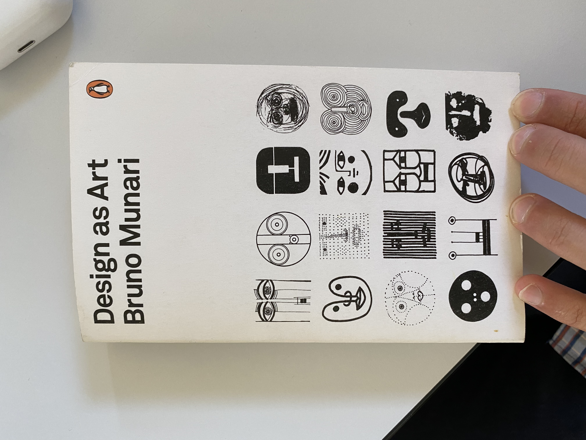
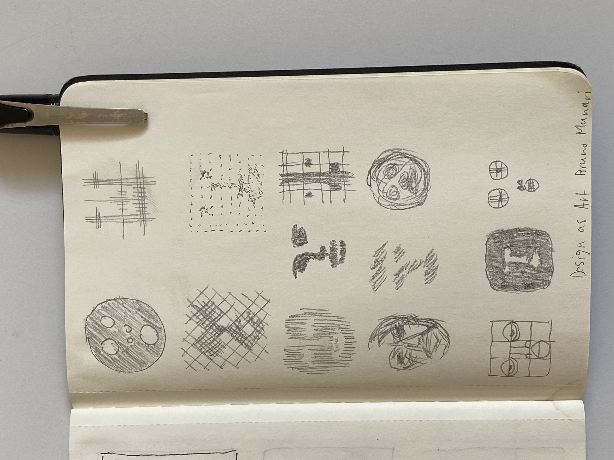

# Day 05
## Faces

For faces I wasn't quite sure what to do. I was intrested in using the webcam to track face features but no idea what to do with those coordinates.

With some input from Guillaume and some other artists I experimented replicating faces from Bruno Murani    
I settled on this rather geometric style, which was fun connecting the face landmarks to generate lines.

<video width="400" height="333" controls>
  <source src="../content/day05/images/faceRec1.mp4" type="video/mp4">
Your browser does not support the video tag.
</video>


<iframe src="../content/day05/mediapipe_facemesh/index.html" width="100%" height="450" frameborder="no"></iframe>

<a href="../content/day05/mediapipe_facemesh/index.html" target="_blank">Fullscreen</a>