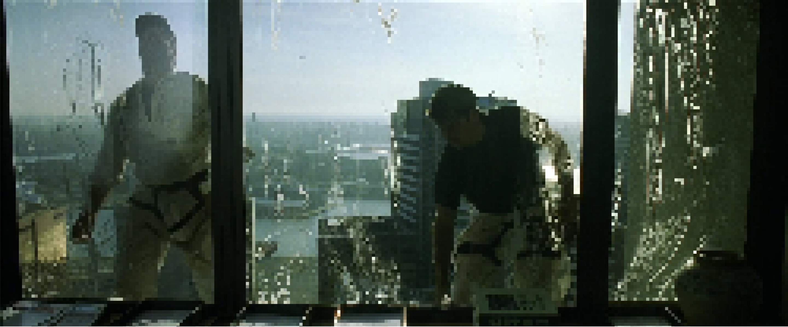
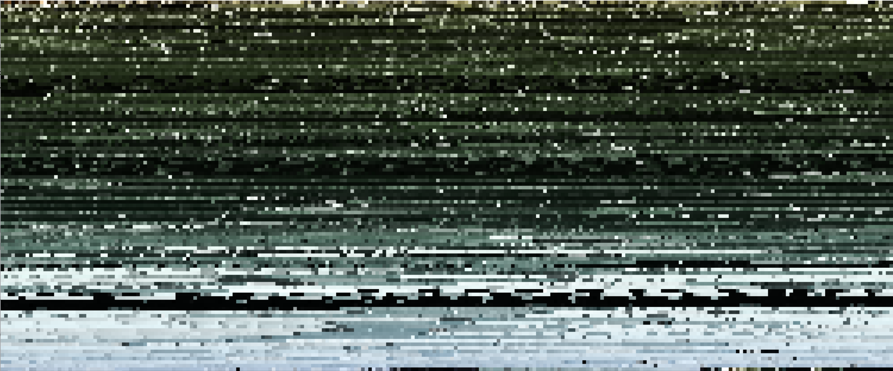

# Day 06
## Pixels

With pixels I looked at sorting pixels, analog to the <a href="http://www.generative-gestaltung.de/2/sketches/?01_P/P_1_2_2_01" target="_blank">example from Generative Gestaltung</a>. 

I tested it out with frames from The Matrix. Following are a few different sorting examples.

<strong>Pixelated</strong>  
  
<strong>Brightness</strong>  
  
<strong>Grayscale</strong>  
  
<strong>Hue</strong>  
  
<strong>Saturation</strong>  
  

Here is the p5 sketch. You can change the sorting parameters by pressing following number:
<ul>
<li>5, pixelated</li>
<li>6, HUE</li>
<li>7, SATURATION</li>
<li>8, BRIGHTNESS</li>
<li>9, GRAYSCALE</li>
</ul>

<iframe src="../content/day06/psorting/index.html" width="100%" height="450" frameborder="no"></iframe>

<a href="../content/day06/psorting/index.html" target="_blank">Fullscreen</a>