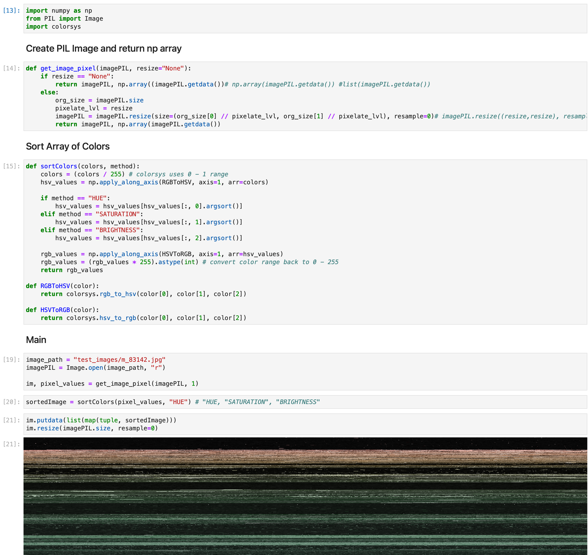
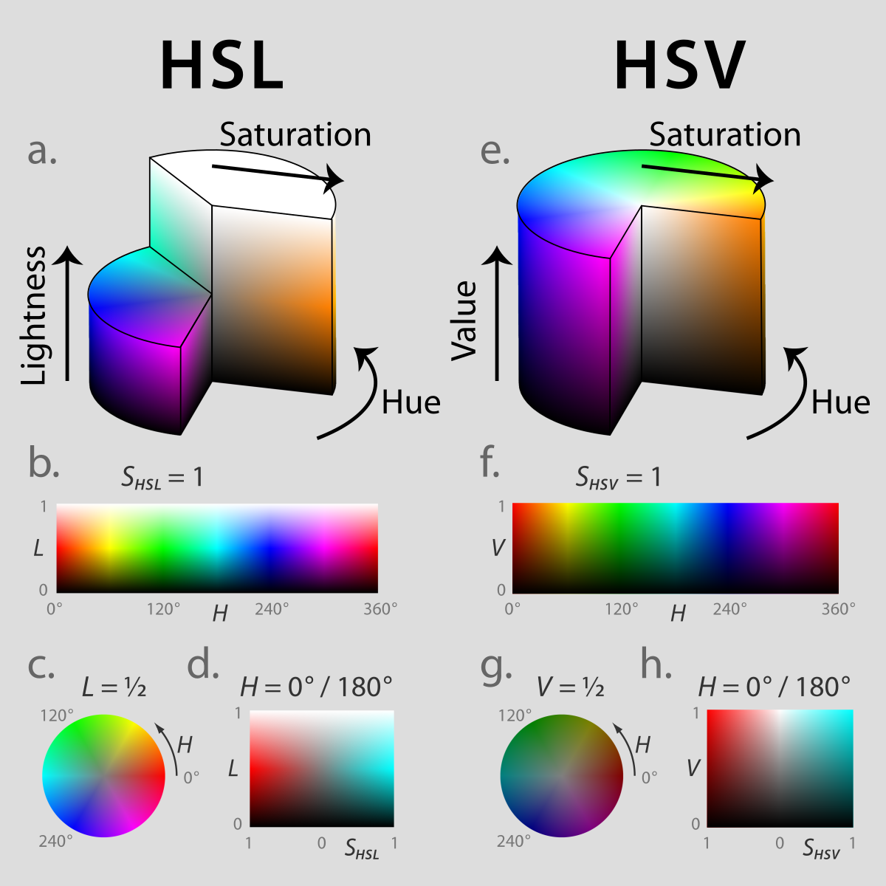
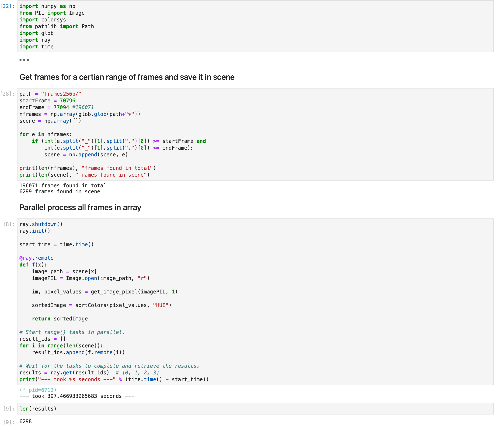
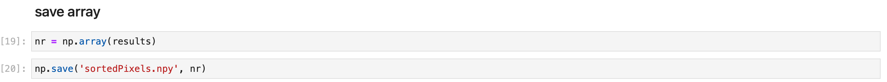
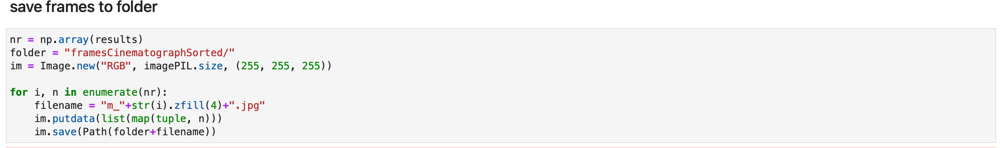

# Final Task

For my final project I decided to work in the realm of pixels. More precise to sort pixel of video frames and play them back as video.
Some Inspiration came from Kevin Workman and his <a href="https://happycoding.io/gallery/movie-colors/index" target="_blank">movie color posters</a> 

The rough outline is as follows:
<ul>
<li>split video into frames with ffmpeg</li>
<li>sort pixels of each frame by hue in python</li>
<li>save pixel as images</li>
<li>merge images to video</li>
</ul>

## splitting video into frames with ffmpeg

Following command allows me to split a video into frames:  
<strong>ffmpeg -i "./myvideo.mp4" "./myvideoframes/m_%04d.jpg" -hide_banner</strong>

## sort pixels of each frame by hue in python

I've decided to do this step in python simply because I felt like it would be quite fun to also use Jupyter Labs as my IDE. And because I will be doing a lot of local file I/O operations.

I looked at the sorting function from <a href="http://www.generative-gestaltung.de/2/sketches/?01_P/P_1_2_2_01" target="_blank">Generative Gestaltung</a> which is part of their library. My inital approach simply copied the same patter as theirs sorting the array with a custom comparetor. But I figured it would be faster using numpy to store the pixel information and using numpy sort function.

Screenshot of my pixel sorting notebook

<a href="../content/day0708/pixelSort.ipynb" target="_blank">Notebook</a>

I've decided to sort by HUE because for me it shows best what colors are used in the movie.
<strong>HSV</strong>  
  

### parallel sorting

One pitfall I encountered was sorting a large amount of frames. I estimated sorting 200'000 frames would take 33h on one core.
I quickly dabbled in multithreading in python and came to the solution of using Ray. This allowed me to process atleast 6298 frames (the lenght of the dojo fight scene in the matrix) on about 397 seconds.

Screenshot of my parallel sorting notebook

<a href="../content/day0708/saveSortedArray.ipynb" target="_blank">Notebook</a>

#### save array
Additionally I saved the array as .npy file to not have to repeat this step at a later time.

## save pixel as images

Lastly I have to save the pixel arrays to file.

<a href="../content/day0708/sortFramesAndSaveImage.ipynb" target="_blank">Notebook</a>

# merge images to video

Following command allows me to merge frames into a video:  
<strong>ffmpeg -r 24 -f image2 -s 1920x1080 -i m_%04d.jpg -vcodec libx264 -crf 25  -pix_fmt yuv420p myvideo.mp4</strong>

Most important paremters are:
-r: framereate (fps)
-s: resolution
-i: images you want use

For more information visit this <a href="https://hamelot.io/visualization/using-ffmpeg-to-convert-a-set-of-images-into-a-video/">site</a>

# Results

A comparision of the dojo fight scene in the matrix with the upper video having its pixels sorted by hue.

<video width="512" height="212" controls autoplay>
  <source src="../content/day0708/images/dojoSceneSorted.mp4" type="video/mp4">
Your browser does not support the video tag.
</video>
<video width="512" height="212" controls autoplay>
  <source src="../content/day0708/images/dojo.mp4" type="video/mp4">
Your browser does not support the video tag.
</video>

   

And as second experiment I used a project from a prior module, where I arranged the whole movie the matrix in a grid so you could watch it in seconds.

<video width="1280" height="720" controls loop autoplay>
  <source src="../content/day0708/images/CinematographReverseSorted.mp4" type="video/mp4">
Your browser does not support the video tag.
</video>
<video width="1280" height="720" controls loop autoplay>
  <source src="../content/day0708/images/CinematographReverse.mp4" type="video/mp4">
Your browser does not support the video tag.
</video>

 

### Future Developments

In future developments I want to create a similar look to Kevin Workman's pieces just with actual frames playing back, so its kind of animated.