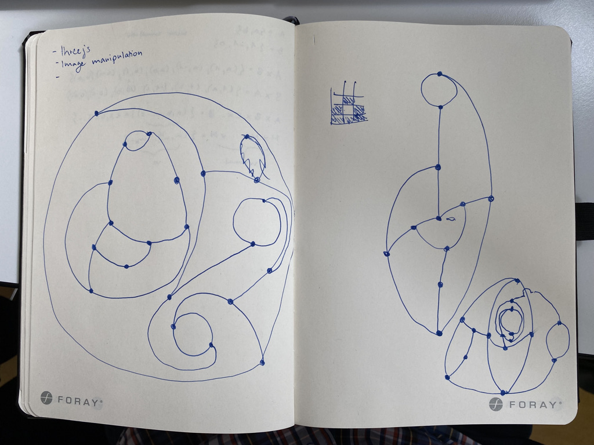
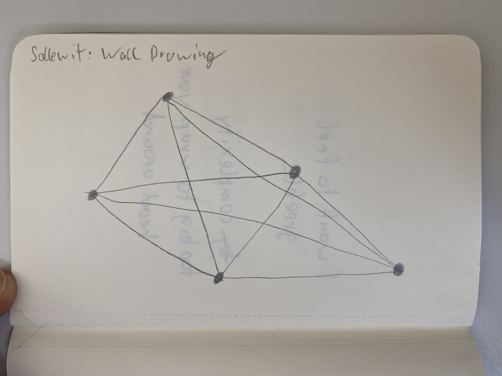

# Day 01

## Sprout

As first exercise we played a physical game called sprout.

## Drawing to code

Place random points and connect all of them with lines.

A reproduction in three.js generating random points on each page load.


<iframe src="content/day01/3dgraph/index.html" width="100%" height="450" frameborder="no"></iframe>
