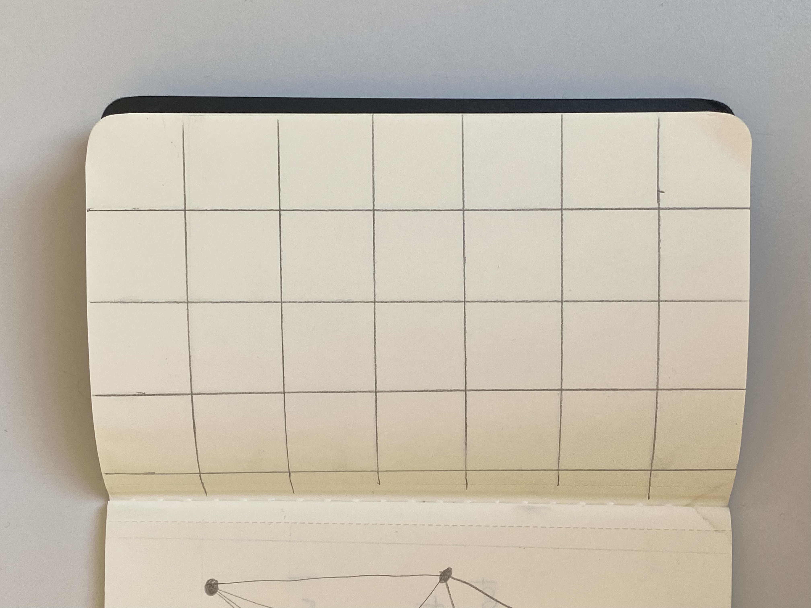
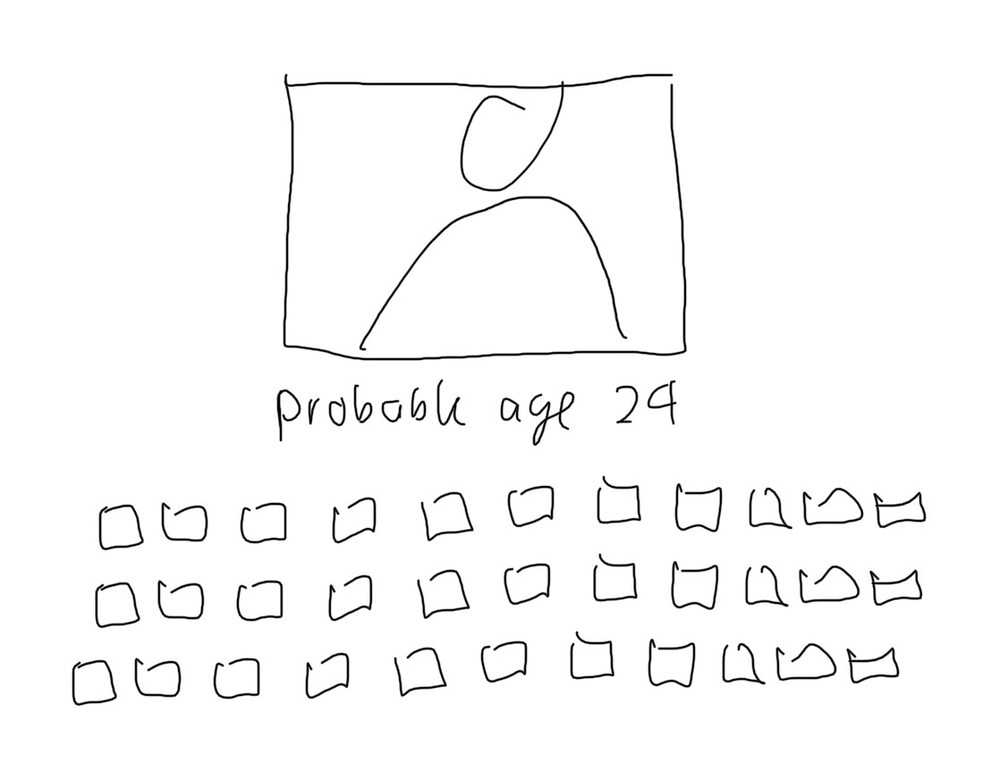

<a href="https://cheesestringhustler.github.io/hslu-gencg-journal/#day-01">This repo is published here</a>

# Day 01

## Sprout

As first exercise we played a physical game called sprout.

## Drawing to code

Place random points and connect all of them with lines.

A reproduction in three.js generating random points on each page load.


<iframe src="content/day01/3dgraph/index.html" width="100%" height="450" frameborder="no"></iframe>


# Day 02

## Iterative Patterns

### Paper Sketch

For the sketch I went with a simple grid, which I imagined to be made of cubes.

### Code

Firstly I started trying to implement the sketch in three.js but for my simple purposes I felt quite overwhelmed having to work with <a href="https://github.com/spite/THREE.MeshLine/blob/master/README.md">MeshGeometry</a> just to change lineWidth.


<iframe src="content/day02/threeCubeGrid/index.html" width="50%" height="225" frameborder="no"></iframe>


So I went with P5.js for now. Adding a rotation to the cubes where every cube should have a diffrent rotation (0-360). Additionally I mapped a color parameter to the rotation.


<iframe src="content/day02/p5CubeGrid/index.html" width="100%" height="550" frameborder="no"></iframe>


### Further

After some quick googling I found a bash version of the Commodore 10Print command with following results.

# Day 03

On this day we focused on representing time in diffrent shapes and sizes.

## Idea 1: Sketch

In my first idea I wanted to create a grid of life representing your time alive in grids, similar to...

And I wanted to calculate to age of the viewer with ML and webcam access but quicklt discared this part to focus on the actual representation.

I also wanted to have some kind of progress visible preferably in seconds, but in a 100 year live this would take ~500 Mio points to represent, making it computional intensive for P5.js. So I settled on just changing the pixels in the window for a 24h span.

## Idea 1: Code


<iframe src="content/day03/gridoflife/index.html" width="100%" height="450" frameborder="no"></iframe>


## Idea 2:  Code

For the second idea I had to try out a few things until I settled on a input from a colleague ("Hey this reminds me of some neon sunset"). I got further inspiration and color from google search . 
P5js allowed for quick POC but with the amount of cubes in this sketch it greatly suffers performance.


<iframe src="content/day03/neonsunset/index.html" width="100%" height="450" frameborder="no"></iframe>
