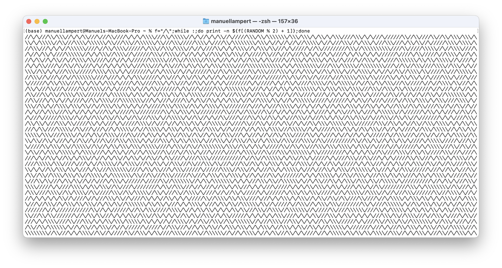
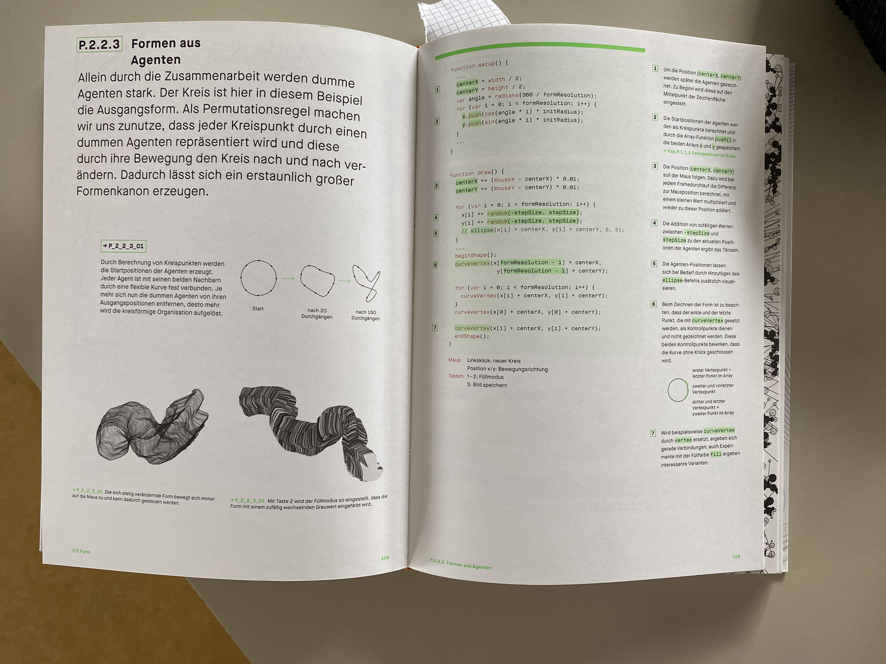
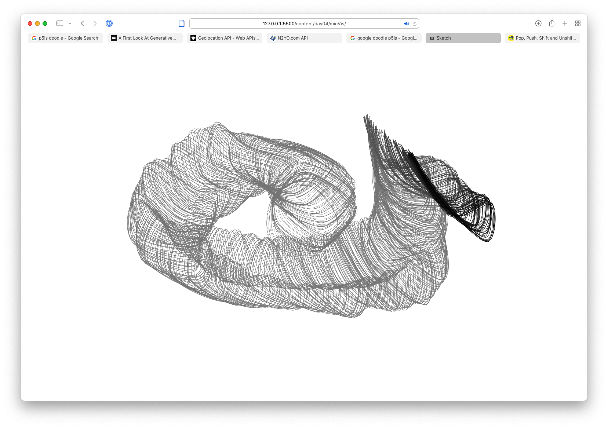
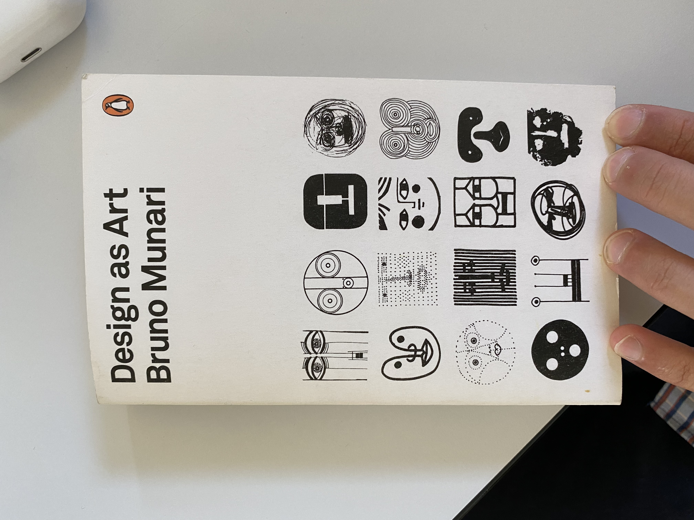
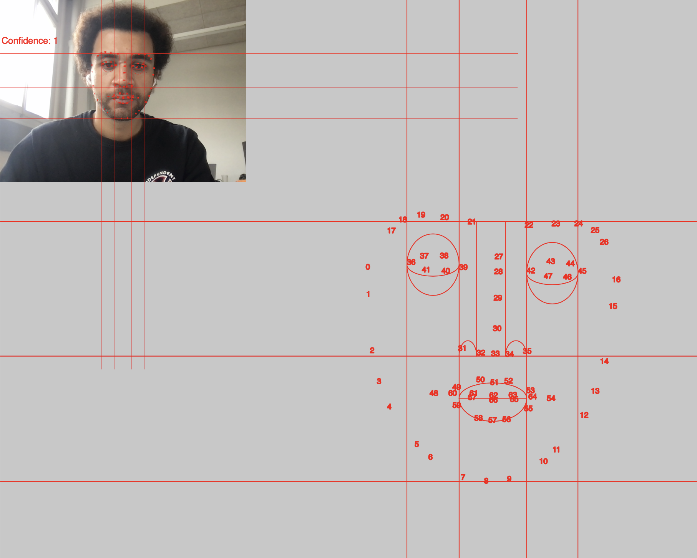

# Day 01

<a href="https://cheesestringhustler.github.io/hslu-gencg-journal/#day-01">This repo is published here</a>

## Sprout

As first exercise we played a physical game called sprout.

## Drawing to code

Place random points and connect all of them with lines.

A reproduction in three.js generating random points on each page load.


<iframe src="content/day01/3dgraph/index.html" width="100%" height="450" frameborder="no"></iframe>

<a href="content/day01/3dgraph/index.html" target="_blank">Fullscreen</a>

# Day 02

## Iterative Patterns

### Paper Sketch

For the sketch I went with a simple grid, which I imagined to be made of cubes.

### Code

Firstly I started trying to implement the sketch in three.js but for my simple purposes I felt quite overwhelmed having to work with <a href="https://github.com/spite/THREE.MeshLine/blob/master/README.md">MeshGeometry</a> just to change lineWidth.


<iframe src="content/day02/threeCubeGrid/index.html" width="50%" height="225" frameborder="no"></iframe>

<a href="content/day02/threeCubeGrid/index.html" target="_blank">Fullscreen</a>

So I went with P5.js for now. Adding a rotation to the cubes where every cube should have a diffrent rotation (0-360). Additionally I mapped a color parameter to the rotation.


<iframe src="content/day02/p5CubeGrid/index.html" width="100%" height="550" frameborder="no"></iframe>

<a href="content/day02/p5CubeGrid/index.html" target="_blank">Fullscreen</a>

### Further

After some quick googling I found a bash version of the Commodore 10Print command with following results.

# Day 03
## Clock

On this day we focused on representing time in diffrent shapes and sizes.

### Idea 1: Sketch

In my first idea I wanted to create a grid of life representing your time alive in grids, similar to...

And I wanted to calculate to age of the viewer with ML and webcam access but quicklt discared this part to focus on the actual representation.

I also wanted to have some kind of progress visible preferably in seconds, but in a 100 year live this would take ~500 Mio points to represent, making it computional intensive for P5.js. So I settled on just changing the pixels in the window for a 24h span.

### Idea 1: Code


<iframe src="content/day03/gridoflife/index.html" width="100%" height="450" frameborder="no"></iframe>


<a href="content/day03/gridoflife/index.html" target="_blank">Fullscreen</a>

### Idea 2:  Code

For the second idea I had to try out a few things until I settled on a input from a colleague ("Hey this reminds me of some neon sunset"). I got further inspiration and color from google search (neon sunset) . 
P5js allowed for quick POC but with the amount of cubes in this sketch it greatly suffers performance.


<iframe src="content/day03/neonsunset/index.html" width="100%" height="450" frameborder="no"></iframe>


<a href="content/day03/neonsunset/index.html" target="_blank">Fullscreen</a>

# Day 04
## Drawing Machines

### Idea 1
For Drawing Machines I had a few Ideas but the one most instresting on a technical level was acceloremter data from a mobile device in a browser.
There is an experimental API <a href="https://developer.mozilla.org/en-US/docs/Web/API/Accelerometer">MDN</a>, <a href="https://medium.com/flawless-app-stories/how-to-request-device-motion-and-orientation-permission-in-ios-13-74fc9d6cd140">Medium Post</a> but it requires that the website uses HTTPS and the user initiates the request for permission via a button or similar. 

For HTTPS I used <a href="https://ngrok.com">ngrok</a> to create a secure connection to my localhost.

Although this <a href='content/day04/accelerometer/index.html'>website</a> is viewable on all devices for the Accelerometer to work one must use a mobile device and press the button in the upper left corner.

<iframe src="content/day04/accelerometer/index.html" width="200" height="200" frameborder="no"></iframe>


<a href="content/day04/accelerometer/index.html" target="_blank">Fullscreen</a>

<video width="443" height="960" controls>
  <source src="content/day04/images/accDot.mp4" type="video/mp4">
Your browser does not support the video tag.
</video>

### Idea 2
For my second Idea I wanted to create something similar to the classic music visualizer from iTunes .
I took some inspiration the book Generative Gestaltung .

A first test of the code from the book

And after getting the mic input working, the result is as following.

<iframe src="content/day04/micVis/index.html" width="100%" height="450" frameborder="no"></iframe>


<a href="content/day04/micVis/index.html" target="_blank">Fullscreen</a>

# Day 05
## Faces

For faces I wasn't quite sure what to do. I was intrested in using the webcam to track face features but no idea what to do with those coordinates.

With some input from Guillaume and some other artists I experimented replicating faces from Bruno Murani    
I settled on this rather geometric style, which was fun connecting the face landmarks to generate lines.

<video width="400" height="333" controls>
  <source src="content/day05/images/faceRec1.mp4" type="video/mp4">
Your browser does not support the video tag.
</video>


<iframe src="content/day05/mediapipe_facemesh/index.html" width="100%" height="450" frameborder="no"></iframe>


<a href="content/day05/mediapipe_facemesh/index.html" target="_blank">Fullscreen</a>

# Day 06
## Pixels

